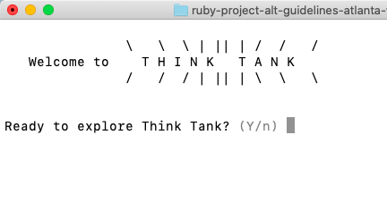
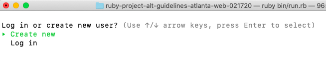
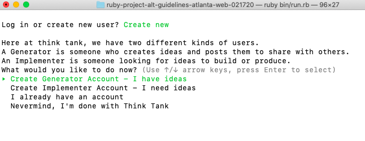
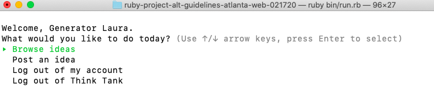
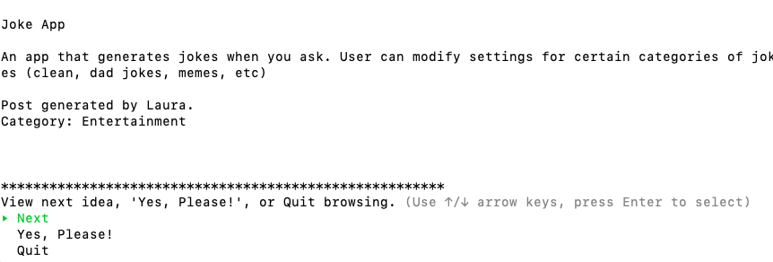
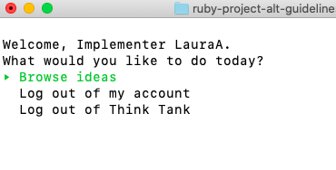
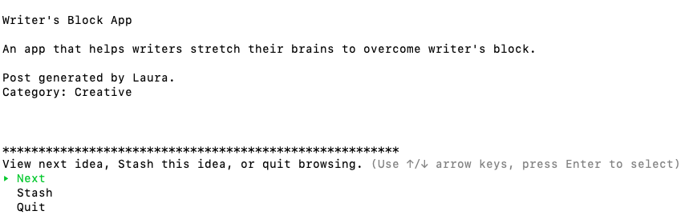

Think Tank CLI Application
========================
by Laura Archambault, Software Engineer

This application was created as a project demonstrating Object-Oriented Ruby and ActiveRecord during my third week of school at The Flatiron School, Atlanta.
---

## Installation

Go to https://github.com/laarchambault/ruby-project-alt-guidelines-atlanta-web-021720. Clone the project to your local computer. _Or feel free to fork and clone to experiment with the app yourself! (Never used github? Here's some instructions: https://product.hubspot.com/blog/git-and-github-tutorial-for-beginners)_

## How to Run

After cloning, navigate to the project folder. Run Bundle Install and then run the program with 'ruby bin/run.rb'.

## How it Works

Think Tank is a place to share ideas you hope to someone will make, or look for ideas to create. On Think Tank, users are either Generators, idea-creators, or Implementers, idea-producers. 

Here at Think Tank, we know the value of a good idea, and want to make the world a better place by connecting ideas to people who can make it happen.

Generators can post ideas, edit and browse, and click "Yes, Please!" to save another idea as something they'd like to see created.

Implementers can browse ideas and stash them.

Explore and enjoy! For suggested improvements and bug fixes, please submit a pull request. Thanks!

### What's the story behind this app?

This application was created as a project demonstrating Object-Oriented Ruby and ActiveRecord during my third week of school at The Flatiron School, Atlanta.

The demonstration requirements: Create three Ruby classes, use ActiveRecord, use has-many relationships, and demonstrate CRUD operations.

C: Users can CREATE ideas and add ideas to a list
R: Users can READ ideas by viewing their own or browsing all ideas, saved ideas, ideas by category, and ideas by keyword search
U: Users can UPDATE (edit) ideas they posted
D: Users can DELETE ideas from their saved list.
